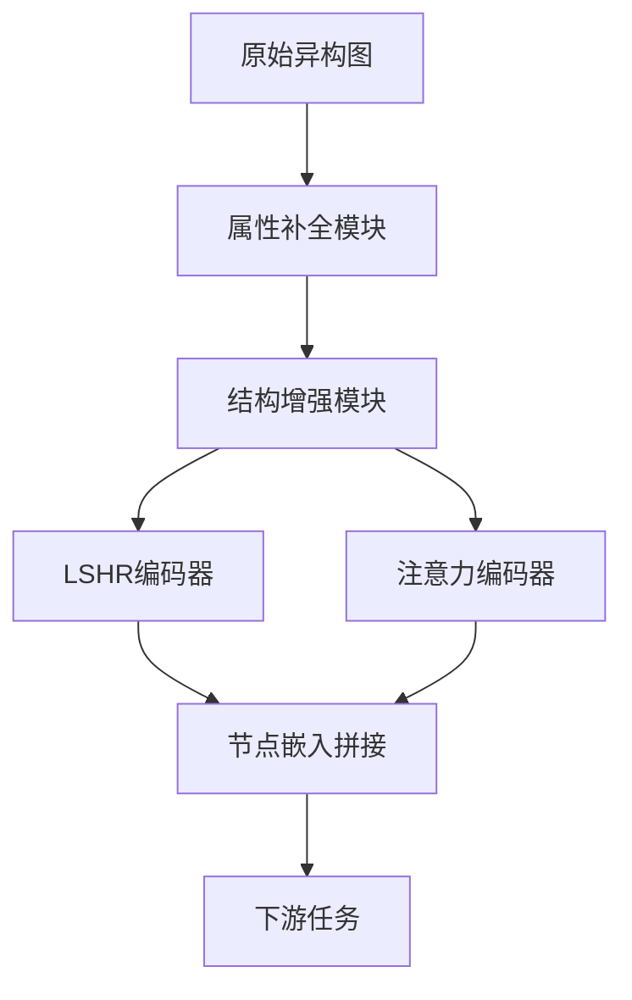

# 异构图形神经网络增强系统 (ADDH) 项目文档

## 1. 项目概述
### 1.1 项目背景
异构图形（Heterogeneous Graphs, HGs）广泛应用于社交网络、推荐系统和生物信息学等领域。然而，现有方法在节点属性缺失和结构稀疏性方面存在显著局限性。本项目基于论文《Dual-Encoder Heterogeneous Graph Neural Network Based on Attribute Completion and Structure Augmentation》提出的ADDH模型，旨在解决以下问题：
- **节点属性缺失**：在ACM引文网络等场景中，作者和主题节点常缺失属性。
- **结构稀疏性**：传统图神经网络难以捕获高阶语义和长程依赖关系。

### 1.2 项目目标
开发一个端到端的异构图形神经网络系统，集成以下功能：
1. **属性补全**：通过多头注意力机制动态补全缺失节点属性。
2. **结构增强**：基于关系评分动态添加潜在边以丰富拓扑结构。
3. **双编码器架构**：结合局部结构编码器（LSHR）和全局注意力编码器，提升表示学习能力。

---

## 2. 问题与方法分类
### 2.1 现有方法分类
| 方法类别          | 代表模型       | 局限性                          |
|-------------------|----------------|---------------------------------|
| 属性补全          | HGNN-AC, AC-HEN| 依赖预训练，难以端到端优化       |
| 结构增强          | GAug, GraphCL  | 未考虑异构图的类型敏感性         |
| 图Transformer     | HINormer, HGT  | 忽略节点属性对表示学习的影响     |

### 2.2 本项目方法
ADDH属于**混合架构**，结合了：
- **属性补全**（Transformer注意力）
- **结构增强**（R-GCN + VGAE）
- **双编码器**（LSHR + 全局注意力）

---
## 3. 核心方法与实现
### 3.1 整体架构

## 4.该软件如何使用及FastAPI封装
# ADDH API 文档

## 目录
1. [API 概览](#api-概览)
2. [训练模型 API](#训练模型-api)
3. [预测 API](#预测-api)
4. [模型信息 API](#模型信息-api)
5. [数据集上传 API](#数据集上传-api)
6. [完整使用指南](#完整使用指南)
7. [注意事项](#注意事项)
---
## API 概览
| 端点               | 方法 | 描述                     |
|--------------------|------|--------------------------|
| `/train`           | POST | 训练HINormer模型         |
| `/predict`         | POST | 执行节点分类预测         |
| `/model_info`      | GET  | 获取当前模型配置信息     |
| `/upload_dataset`  | POST | 上传自定义数据集         |

---
## 训练模型 API

### 请求
- **路径**: `POST /train`
- **Content-Type**: `application/json`

### 参数说明
```json
{
    "feats_type": "int (0-5, default=3)",
    "device": "int (GPU ID, default=0)",
    "hidden_dim": "int (default=256)",
    "dataset": "str (default='DBLP')",
    "num_heads": "int (default=2)",
    "epoch": "int (default=1000)",
    "patience": "int (default=50)",
    "repeat": "int (default=5)",
    "num_layers": "int (default=2)",
    "num_gnns": "int (default=4)",
    "lr": "float (default=1e-4)",
    "seed": "int (default=2023)",
    "dropout": "float (default=0.5)",
    "weight_decay": "float (default=0)",
    "len_seq": "int (default=200)",
    "l2norm": "bool (default=true)",
    "mode": "int (0-1, default=0)",
    "temperature": "float (default=1.0)",
    "beta": "float (default=1.0)"
}
```
### 响应示例
```json
{
    "status": "success",
    "message": "Model trained successfully",
    "results": {
        "micro_f1_mean": 0.85,
        "micro_f1_std": 0.02,
        "macro_f1_mean": 0.83,
        "macro_f1_std": 0.03
    }
}
```
## 预测 API
### 请求
- **路径**: `POST /predict`
- **Content-Type**: `application/json`
### 响应示例
```json
{"predictions": [0, 2, 1]}
```
### 带概率的响应
```json
{
    "predictions": [0, 2, 1],
    "probabilities": [
        [0.9, 0.1, 0.0],
        [0.1, 0.2, 0.7],
        [0.3, 0.6, 0.1]
    ]
}
```
## 模型信息 API
### 请求
- **路径**: `GET /model_info`
### 响应示例
```json
{
    "dataset": "DBLP",
    "hidden_dim": 256,
    "num_layers": 2,
    "num_heads": 2,
    "dropout": 0.5,
    "device": "cuda:0"
}
```
## 数据集上传 API
### 请求
- **路径**: `POST /upload_dataset`
- **Content-Type**: `multipart/form-data`
### 响应示例
```json
{
    "status": "success",
    "message": "Dataset uploaded successfully",
    "file_path": "/tmp/xyz/dataset.pkl"
}
```
## 完整使用指南
### 1. 启动服务
uvicorn fastapi_app:app --reload --host 0.0.0.0 --port 8000
### 2. Python 客户端示例
import requests
### 训练模型
train_config = {
    "dataset": "DBLP",
    "epoch": 100,
    "hidden_dim": 128
}
response = requests.post("http://localhost:8000/train", json=train_config)
### 执行预测
predict_data = {
    "node_indices": [1, 2, 3],
    "return_probabilities": True
}
response = requests.post("http://localhost:8000/predict", json=predict_data)
### 上传数据集
with open("data.pkl", "rb") as f:
    response = requests.post("http://localhost:8000/upload_dataset", files={"file": f})
### 3. cURL 示例
### 训练模型
curl -X POST "http://localhost:8000/train" \
-H "Content-Type: application/json" \
-d '{"dataset": "IMDB", "epoch": 200}'
### 获取模型信息
curl "http://localhost:8000/model_info"
### 4. 注意事项
训练前确保存在 checkpoint/ 目录\
预测前必须先训练模型\
上传数据集后需要自行实现处理逻辑\
生产环境建议添加认证机制\
默认使用CUDA设备，如需CPU运行设置 "device": -1
## 5.该软件运行截图以及API调用截图


## 6. 数据集

## 异构图神经网络基准数据集

### 数据集统计表

| 数据集    | 节点数  | 节点类型数 | 边数     | 边类型数 | 类别数 | 目标节点类型 |
|-----------|--------:|-----------:|---------:|---------:|-------:|-------------:|
| DBLP      | 26,128  | 4          | 239,566  | 6        | 4      | 作者(author)  |
| IMDB      | 21,420  | 4          | 86,642   | 6        | 5      | 电影(movie)   |
| Freebase  | 43,854  | 4          | 151,034  | 6        | 3      | 电影(movie)   |
| ACM       | 10,942  | 4          | 547,872  | 8        | 3      | 论文(paper)   |

##  数据集详细说明
### 1. DBLP学术网络
- **领域**：计算机科学文献
- **节点类型**：
  - 作者(author)
  - 论文(paper) 
  - 会议(conference)
  - 关键词(term)
- **任务**：作者研究方向分类
- **类别**：4个研究领域（数据库/数据挖掘/机器学习/计算机网络）
- **特点**：作者合作网络密集，边类型包含"撰写"/"发表"/"引用"等
### 2. IMDB电影网络
- **领域**：电影产业
- **节点类型**：
  - 电影(movie)
  - 演员(actor)
  - 导演(director)
  - 制片人(producer)  
- **任务**：电影类型分类
- **类别**：5种电影类型（动作/喜剧/爱情/科幻/惊悚）
- **特点**：包含导演-演员等多模态关系

### 3. Freebase知识图谱
- **领域**：通用知识库
- **节点类型**：
  - 电影(movie)
  - 演员(actor)
  - 导演(director)
  - 制片公司(company)
- **任务**：电影题材分类  
- **类别**：3种题材（商业电影/独立电影/艺术电影）

### 4. ACM论文网络
- **领域**：计算机科学论文
- **节点类型**：
  - 论文(paper)
  - 作者(author)
  - 会议(conference)
  - 关键词(term)
- **任务**：论文主题分类
- **类别**：3个CCF分类（A类/B类/C类）
- **特点**：引文网络规模大，包含547,872条边

## 数据预处理说明
所有数据集均已进行以下处理：
1. 节点ID重新索引（从0开始连续编号）
2. 边类型采用One-hot编码
3. 目标节点已标注分类标签
4. 默认划分比例：训练集60%/验证集20%/测试集20%
## 7. 代码要求
### （1）方法：包含方法的核心代码
```python
{
import argparse
import os
import random
import sys
import time

import dgl
import numpy as np
import torch
import torch.nn.functional as F

from model import HINormer
from utils.data import load_data
from utils.pytorchtools import EarlyStopping

os.environ['CUDA_LAUNCH_BLOCKING'] = '1'

sys.path.append('utils/')


def sp_to_spt(mat):
    coo = mat.tocoo()
    values = coo.data
    indices = np.vstack((coo.row, coo.col))

    i = torch.LongTensor(indices)
    v = torch.FloatTensor(values)
    shape = coo.shape

    return torch.sparse.FloatTensor(i, v, torch.Size(shape))


def mat2tensor(mat):
    if type(mat) is np.ndarray:
        return torch.from_numpy(mat).type(torch.FloatTensor)
    return sp_to_spt(mat)


def run_model_DBLP(args):
    if not os.path.exists('checkpoint/'):
        os.makedirs('checkpoint/')

    feats_type = args.feats_type
    features_list, adjM, labels, train_val_test_idx, dl = load_data(args.dataset)
    device = torch.device('cuda:' + str(args.device)
                          if torch.cuda.is_available() else 'cpu')
    features_list = [mat2tensor(features).to(device)
                     for features in features_list]
    node_cnt = [features.shape[0] for features in features_list]
    sum_node = 0
    for x in node_cnt:
        sum_node += x
    if feats_type == 0:
        in_dims = [features.shape[1] for features in features_list]
    elif feats_type == 1 or feats_type == 5:
        save = 0 if feats_type == 1 else 2
        in_dims = []
        for i in range(0, len(features_list)):
            if i == save:
                in_dims.append(features_list[i].shape[1])
            else:
                in_dims.append(10)
                features_list[i] = torch.zeros(
                    (features_list[i].shape[0], 10)).to(device)
    elif feats_type == 2 or feats_type == 4:
        save = feats_type - 2
        in_dims = [features.shape[0] for features in features_list]
        for i in range(0, len(features_list)):
            if i == save:
                in_dims[i] = features_list[i].shape[1]
                continue
            dim = features_list[i].shape[0]
            indices = np.vstack((np.arange(dim), np.arange(dim)))
            indices = torch.LongTensor(indices)
            values = torch.FloatTensor(np.ones(dim))
            features_list[i] = torch.sparse.FloatTensor(
                indices, values, torch.Size([dim, dim])).to(device)
    elif feats_type == 3:
        in_dims = [features.shape[0] for features in features_list]
        for i in range(len(features_list)):
            dim = features_list[i].shape[0]
            indices = np.vstack((np.arange(dim), np.arange(dim)))
            indices = torch.LongTensor(indices)
            values = torch.FloatTensor(np.ones(dim))
            features_list[i] = torch.sparse.FloatTensor(
                indices, values, torch.Size([dim, dim])).to(device)

    labels = torch.LongTensor(labels).to(device)
    train_idx = train_val_test_idx['train_idx']
    train_idx = np.sort(train_idx)
    val_idx = train_val_test_idx['val_idx']
    val_idx = np.sort(val_idx)
    test_idx = train_val_test_idx['test_idx']
    test_idx = np.sort(test_idx)

    g = dgl.DGLGraph(adjM + (adjM.T))
    g = dgl.remove_self_loop(g)

    all_nodes = np.arange(features_list[0].shape[0])

    node_seq = torch.zeros(features_list[0].shape[0], args.len_seq).long()

    n = 0

    for x in all_nodes:

        cnt = 0
        scnt = 0
        node_seq[n, cnt] = x
        cnt += 1
        start = node_seq[n, scnt].item()
        while (cnt < args.len_seq):
            sample_list = g.successors(start).numpy().tolist()
            nsampled = max(len(sample_list), 1)
            sampled_list = random.sample(sample_list, nsampled)
            for i in range(nsampled):
                node_seq[n, cnt] = sampled_list[i]
                cnt += 1
                if cnt == args.len_seq:
                    break
            scnt += 1
            start = node_seq[n, scnt].item()
        n += 1

    node_type = [i for i, z in zip(range(len(node_cnt)), node_cnt) for x in range(z)]

    g = g.to(device)
    train_seq = node_seq[train_idx]
    val_seq = node_seq[val_idx]
    test_seq = node_seq[test_idx]

    micro_f1 = torch.zeros(args.repeat)
    macro_f1 = torch.zeros(args.repeat)

    num_classes = dl.labels_train['num_classes']
    type_emb = torch.eye(len(node_cnt)).to(device)
    node_type = torch.tensor(node_type).to(device)

    for i in range(args.repeat):

        net = HINormer(g, num_classes, in_dims, args.hidden_dim, args.num_layers, args.num_gnns, args.num_heads,
                       args.dropout,
                       temper=args.temperature, num_type=len(node_cnt), beta=args.beta)

        net.to(device)
        optimizer = torch.optim.Adam(net.parameters(), lr=args.lr, weight_decay=args.weight_decay)
        scheduler = torch.optim.lr_scheduler.ReduceLROnPlateau(optimizer, 'min')

        # training loop
        net.train()
        early_stopping = EarlyStopping(patience=args.patience, verbose=True,
                                       save_path='checkpoint/HINormer_{}_{}_{}.pt'.format(args.dataset, args.num_layers,
                                                                                          args.device))
        for epoch in range(args.epoch):
            t_start = time.time()
            # training
            net.train()

            logits = net(features_list, train_seq, type_emb, node_type, args.l2norm)
            logp = F.log_softmax(logits, 1)
            train_loss = F.nll_loss(logp, labels[train_idx])

            # autograd
            optimizer.zero_grad()
            train_loss.backward()
            optimizer.step()

            t_end = time.time()

            # print training info
            print('Epoch {:05d} | Train_Loss: {:.4f} | Time: {:.4f}'.format(
                epoch, train_loss.item(), t_end - t_start))

            t_start = time.time()

            # validation
            net.eval()
            with torch.no_grad():
                logits = net(features_list, val_seq, type_emb, node_type, args.l2norm)
                logp = F.log_softmax(logits, 1)
                val_loss = F.nll_loss(logp, labels[val_idx])
                pred = logits.cpu().numpy().argmax(axis=1)
                onehot = np.eye(num_classes, dtype=np.int32)
                pred = onehot[pred]
                print(dl.evaluate_valid(pred, dl.labels_train['data'][val_idx]))

            scheduler.step(val_loss)
            t_end = time.time()
            # print validation info
            print('Epoch {:05d} | Val_Loss {:.4f} | Time(s) {:.4f}'.format(
                epoch, val_loss.item(), t_end - t_start))
            # early stopping
            early_stopping(val_loss, net)
            if early_stopping.early_stop:
                print('Early stopping!')
                break

        # testing with evaluate_results_nc
        net.load_state_dict(torch.load(
            'checkpoint/HINormer_{}_{}_{}.pt'.format(args.dataset, args.num_layers, args.device)))
        net.eval()
        with torch.no_grad():
            logits = net(features_list, test_seq, type_emb, node_type, args.l2norm)
            test_logits = logits
            if args.mode == 1:
                pred = test_logits.cpu().numpy().argmax(axis=1)
                dl.gen_file_for_evaluate(test_idx=test_idx, label=pred, file_name=f"{args.dataset}_{i + 1}.txt")
            else:
                pred = test_logits.cpu().numpy().argmax(axis=1)
                onehot = np.eye(num_classes, dtype=np.int32)
                pred = onehot[pred]
                result = dl.evaluate_valid(pred, dl.labels_test['data'][test_idx])
                print(result)
                micro_f1[i] = result['micro-f1']
                macro_f1[i] = result['macro-f1']
    print('Micro-f1: %.4f, std: %.4f' % (micro_f1.mean().item(), micro_f1.std().item()))
    print('Macro-f1: %.4f, std: %.4f' % (macro_f1.mean().item(), macro_f1.std().item()))


if __name__ == '__main__':
    ap = argparse.ArgumentParser(
        description='HINormer')
    ap.add_argument('--feats-type', type=int, default=3,
                    help='Type of the node features used. ' +
                         '0 - loaded features; ' +
                         '1 - only target node features (zero vec for others); ' +
                         '2 - only target node features (id vec for others); ' +
                         '3 - all id vec. Default is 2' +
                         '4 - only term features (id vec for others);' +
                         '5 - only term features (zero vec for others).')
    ap.add_argument('--device', type=int, default=0)
    ap.add_argument('--hidden-dim', type=int, default=256,
                    help='Dimension of the node hidden state. Default is 32.')
    ap.add_argument('--dataset', type=str, default='DBLP', help='DBLP, IMDB, Freebase, AMiner, DBLP-HGB, IMDB-HGB')
    ap.add_argument('--num-heads', type=int, default=2,
                    help='Number of the attention heads. Default is 2.')
    ap.add_argument('--epoch', type=int, default=1000, help='Number of epochs.')
    ap.add_argument('--patience', type=int, default=50, help='Patience.')
    ap.add_argument('--repeat', type=int, default=5, help='Repeat the training and testing for N times. Default is 1.')
    ap.add_argument('--num-layers', type=int, default=2, help='The number of layers of HINormer layer')
    ap.add_argument('--num-gnns', type=int, default=4,
                    help='The number of layers of both structural and heterogeneous encoder')
    ap.add_argument('--lr', type=float, default=1e-4)
    ap.add_argument('--seed', type=int, default=2023)
    ap.add_argument('--dropout', type=float, default=0.5)
    ap.add_argument('--weight-decay', type=float, default=0)
    ap.add_argument('--len-seq', type=int, default=200, help='The length of node sequence.')
    ap.add_argument('--l2norm', type=bool, default=True, help='Use l2 norm for prediction')
    ap.add_argument('--mode', type=int, default=0,
                    help='Output mode, 0 for offline evaluation and 1 for online HGB evaluation')
    ap.add_argument('--temperature', type=float, default=1.0, help='Temperature of attention score')
    ap.add_argument('--beta', type=float, default=1.0, help='Weight of heterogeneity-level attention score')

    args = ap.parse_args()
    run_model_DBLP(args)
}
```
### （2）封装：包含封装 API 的代码
```puyhon
{
from fastapi import FastAPI, HTTPException, UploadFile, File, Form
from fastapi.responses import JSONResponse, FileResponse
from pydantic import BaseModel
import uvicorn
import argparse
import os
import random
import sys
import time
import dgl
import numpy as np
import torch
import torch.nn.functional as F
from typing import Optional, Dict, List
import tempfile
import shutil

# Import your existing code components
from model import HINormer
from utils.data import load_data
from utils.pytorchtools import EarlyStopping

app = FastAPI(title="ADDH API",
              description="API for HINormer heterogeneous graph neural network")

# Global variables to store the model and its state
global_model = None
global_device = None
global_args = None
global_dl = None
global_features_list = None
global_node_seq = None
global_type_emb = None
global_node_type = None


class TrainRequest(BaseModel):
    feats_type: int = 3
    device: int = 0
    hidden_dim: int = 256
    dataset: str = "DBLP"
    num_heads: int = 2
    epoch: int = 1000
    patience: int = 50
    repeat: int = 5
    num_layers: int = 2
    num_gnns: int = 4
    lr: float = 1e-4
    seed: int = 2023
    dropout: float = 0.5
    weight_decay: float = 0
    len_seq: int = 200
    l2norm: bool = True
    mode: int = 0
    temperature: float = 1.0
    beta: float = 1.0


class PredictRequest(BaseModel):
    node_indices: List[int]
    return_probabilities: bool = False


def setup_args_from_request(request: TrainRequest):
    args = argparse.Namespace()
    args.feats_type = request.feats_type
    args.device = request.device
    args.hidden_dim = request.hidden_dim
    args.dataset = request.dataset
    args.num_heads = request.num_heads
    args.epoch = request.epoch
    args.patience = request.patience
    args.repeat = request.repeat
    args.num_layers = request.num_layers
    args.num_gnns = request.num_gnns
    args.lr = request.lr
    args.seed = request.seed
    args.dropout = request.dropout
    args.weight_decay = request.weight_decay
    args.len_seq = request.len_seq
    args.l2norm = request.l2norm
    args.mode = request.mode
    args.temperature = request.temperature
    args.beta = request.beta
    return args


def sp_to_spt(mat):
    coo = mat.tocoo()
    values = coo.data
    indices = np.vstack((coo.row, coo.col))
    i = torch.LongTensor(indices)
    v = torch.FloatTensor(values)
    shape = coo.shape
    return torch.sparse.FloatTensor(i, v, torch.Size(shape))


def mat2tensor(mat):
    if type(mat) is np.ndarray:
        return torch.from_numpy(mat).type(torch.FloatTensor)
    return sp_to_spt(mat)


@app.post("/train")
async def train_model(request: TrainRequest):
    global global_model, global_device, global_args, global_dl, global_features_list, global_node_seq, global_type_emb, global_node_type

    try:
        args = setup_args_from_request(request)

        if not os.path.exists('checkpoint/'):
            os.makedirs('checkpoint/')

        # Load data
        features_list, adjM, labels, train_val_test_idx, dl = load_data(args.dataset)
        device = torch.device('cuda:' + str(args.device) if torch.cuda.is_available() else 'cpu')
        features_list = [mat2tensor(features).to(device) for features in features_list]

        # Process features based on feats_type
        node_cnt = [features.shape[0] for features in features_list]
        sum_node = sum(node_cnt)

        if args.feats_type == 0:
            in_dims = [features.shape[1] for features in features_list]
        elif args.feats_type == 1 or args.feats_type == 5:
            save = 0 if args.feats_type == 1 else 2
            in_dims = []
            for i in range(len(features_list)):
                if i == save:
                    in_dims.append(features_list[i].shape[1])
                else:
                    in_dims.append(10)
                    features_list[i] = torch.zeros((features_list[i].shape[0], 10)).to(device)
        elif args.feats_type == 2 or args.feats_type == 4:
            save = args.feats_type - 2
            in_dims = [features.shape[0] for features in features_list]
            for i in range(len(features_list)):
                if i == save:
                    in_dims[i] = features_list[i].shape[1]
                    continue
                dim = features_list[i].shape[0]
                indices = np.vstack((np.arange(dim), np.arange(dim)))
                indices = torch.LongTensor(indices)
                values = torch.FloatTensor(np.ones(dim))
                features_list[i] = torch.sparse.FloatTensor(indices, values, torch.Size([dim, dim])).to(device)
        elif args.feats_type == 3:
            in_dims = [features.shape[0] for features in features_list]
            for i in range(len(features_list)):
                dim = features_list[i].shape[0]
                indices = np.vstack((np.arange(dim), np.arange(dim)))
                indices = torch.LongTensor(indices)
                values = torch.FloatTensor(np.ones(dim))
                features_list[i] = torch.sparse.FloatTensor(indices, values, torch.Size([dim, dim])).to(device)

        labels = torch.LongTensor(labels).to(device)
        train_idx = np.sort(train_val_test_idx['train_idx'])
        val_idx = np.sort(train_val_test_idx['val_idx'])
        test_idx = np.sort(train_val_test_idx['test_idx'])

        # Build graph and node sequences
        g = dgl.DGLGraph(adjM + (adjM.T))
        g = dgl.remove_self_loop(g)
        all_nodes = np.arange(features_list[0].shape[0])
        node_seq = torch.zeros(features_list[0].shape[0], args.len_seq).long()

        for n, x in enumerate(all_nodes):
            cnt = 0
            scnt = 0
            node_seq[n, cnt] = x
            cnt += 1
            start = node_seq[n, scnt].item()
            while cnt < args.len_seq:
                sample_list = g.successors(start).numpy().tolist()
                nsampled = max(len(sample_list), 1)
                sampled_list = random.sample(sample_list, nsampled)
                for i in range(nsampled):
                    node_seq[n, cnt] = sampled_list[i]
                    cnt += 1
                    if cnt == args.len_seq:
                        break
                scnt += 1
                start = node_seq[n, scnt].item()

        node_type = [i for i, z in zip(range(len(node_cnt)), node_cnt) for x in range(z)]
        g = g.to(device)
        train_seq = node_seq[train_idx]
        val_seq = node_seq[val_idx]
        test_seq = node_seq[test_idx]

        # Training loop
        num_classes = dl.labels_train['num_classes']
        type_emb = torch.eye(len(node_cnt)).to(device)
        node_type = torch.tensor(node_type).to(device)

        micro_f1 = torch.zeros(args.repeat)
        macro_f1 = torch.zeros(args.repeat)

        for i in range(args.repeat):
            net = HINormer(g, num_classes, in_dims, args.hidden_dim, args.num_layers, args.num_gnns, args.num_heads,
                           args.dropout, temper=args.temperature, num_type=len(node_cnt), beta=args.beta)
            net.to(device)
            optimizer = torch.optim.Adam(net.parameters(), lr=args.lr, weight_decay=args.weight_decay)
            scheduler = torch.optim.lr_scheduler.ReduceLROnPlateau(optimizer, 'min')

            net.train()
            early_stopping = EarlyStopping(patience=args.patience, verbose=True,
                                           save_path=f'checkpoint/HINormer_{args.dataset}_{args.num_layers}_{args.device}.pt')

            for epoch in range(args.epoch):
                t_start = time.time()
                net.train()
                logits = net(features_list, train_seq, type_emb, node_type, args.l2norm)
                logp = F.log_softmax(logits, 1)
                train_loss = F.nll_loss(logp, labels[train_idx])

                optimizer.zero_grad()
                train_loss.backward()
                optimizer.step()

                t_end = time.time()
                print(f'Epoch {epoch:05d} | Train_Loss: {train_loss.item():.4f} | Time: {t_end - t_start:.4f}')

                t_start = time.time()
                net.eval()
                with torch.no_grad():
                    logits = net(features_list, val_seq, type_emb, node_type, args.l2norm)
                    logp = F.log_softmax(logits, 1)
                    val_loss = F.nll_loss(logp, labels[val_idx])
                    pred = logits.cpu().numpy().argmax(axis=1)
                    onehot = np.eye(num_classes, dtype=np.int32)
                    pred = onehot[pred]
                    print(dl.evaluate_valid(pred, dl.labels_train['data'][val_idx]))

                scheduler.step(val_loss)
                t_end = time.time()
                print(f'Epoch {epoch:05d} | Val_Loss {val_loss.item():.4f} | Time(s) {t_end - t_start:.4f}')

                early_stopping(val_loss, net)
                if early_stopping.early_stop:
                    print('Early stopping!')
                    break

            # Load best model and test
            net.load_state_dict(torch.load(
                f'checkpoint/HINormer_{args.dataset}_{args.num_layers}_{args.device}.pt'))
            net.eval()
            with torch.no_grad():
                logits = net(features_list, test_seq, type_emb, node_type, args.l2norm)
                test_logits = logits
                if args.mode == 1:
                    pred = test_logits.cpu().numpy().argmax(axis=1)
                    dl.gen_file_for_evaluate(test_idx=test_idx, label=pred, file_name=f"{args.dataset}_{i + 1}.txt")
                else:
                    pred = test_logits.cpu().numpy().argmax(axis=1)
                    onehot = np.eye(num_classes, dtype=np.int32)
                    pred = onehot[pred]
                    result = dl.evaluate_valid(pred, dl.labels_test['data'][test_idx])
                    print(result)
                    micro_f1[i] = result['micro-f1']
                    macro_f1[i] = result['macro-f1']

        # Store the trained model and related data
        global_model = net
        global_device = device
        global_args = args
        global_dl = dl
        global_features_list = features_list
        global_node_seq = node_seq
        global_type_emb = type_emb
        global_node_type = node_type

        return {
            "status": "success",
            "message": "Model trained successfully",
            "results": {
                "micro_f1_mean": micro_f1.mean().item(),
                "micro_f1_std": micro_f1.std().item(),
                "macro_f1_mean": macro_f1.mean().item(),
                "macro_f1_std": macro_f1.std().item()
            }
        }
    except Exception as e:
        raise HTTPException(status_code=500, detail=str(e))


@app.post("/predict")
async def predict(request: PredictRequest):
    global global_model, global_device, global_features_list, global_node_seq, global_type_emb, global_node_type

    if global_model is None:
        raise HTTPException(status_code=400, detail="Model not trained yet. Please train the model first.")

    try:
        node_indices = request.node_indices
        return_probs = request.return_probabilities

        # Convert node indices to tensor
        node_indices_tensor = torch.tensor(node_indices).to(global_device)

        # Get sequences for the requested nodes
        pred_seq = global_node_seq[node_indices_tensor]

        # Make predictions
        global_model.eval()
        with torch.no_grad():
            logits = global_model(global_features_list, pred_seq, global_type_emb, global_node_type, global_args.l2norm)

            if return_probs:
                probs = F.softmax(logits, dim=1).cpu().numpy().tolist()
                predictions = logits.argmax(dim=1).cpu().numpy().tolist()
                return {
                    "predictions": predictions,
                    "probabilities": probs
                }
            else:
                predictions = logits.argmax(dim=1).cpu().numpy().tolist()
                return {"predictions": predictions}

    except Exception as e:
        raise HTTPException(status_code=500, detail=str(e))


@app.get("/model_info")
async def get_model_info():
    global global_model, global_args

    if global_model is None:
        raise HTTPException(status_code=400, detail="Model not trained yet.")

    return {
        "dataset": global_args.dataset,
        "hidden_dim": global_args.hidden_dim,
        "num_layers": global_args.num_layers,
        "num_heads": global_args.num_heads,
        "dropout": global_args.dropout,
        "device": str(global_device)
    }


@app.post("/upload_dataset")
async def upload_dataset(file: UploadFile = File(...)):
    try:
        # Create a temporary directory to save the uploaded file
        temp_dir = tempfile.mkdtemp()
        file_path = os.path.join(temp_dir, file.filename)

        # Save the uploaded file
        with open(file_path, "wb") as buffer:
            shutil.copyfileobj(file.file, buffer)

        # Here you would add code to process the uploaded dataset
        # For now, we'll just return a success message
        return {"status": "success", "message": "Dataset uploaded successfully", "file_path": file_path}
    except Exception as e:
        raise HTTPException(status_code=500, detail=str(e))
    finally:
        file.file.close()


if __name__ == "__main__":
    uvicorn.run(app, host="0.0.0.0", port=8000)
}
```
### （3）运行：若封装方式为 API，需有调用 API 的测试代码；
```python
{
import requests
import json
import time

# 基础配置
BASE_URL = "http://localhost:8000"
HEADERS = {"Content-Type": "application/json"}

def test_train_api():
    """测试训练接口"""
    print("\n=== 测试训练接口 ===")
    
    # 训练配置（使用DBLP数据集简化参数）
    train_config = {
        "dataset": "DBLP",
        "epoch": 50,          # 减少训练轮次加速测试
        "patience": 10,       # 早停耐心值
        "hidden_dim": 128,    # 减小隐藏层维度
        "num_heads": 2,
        "device": 0 if torch.cuda.is_available() else -1
    }
    
    try:
        # 发送训练请求
        start_time = time.time()
        response = requests.post(
            f"{BASE_URL}/train",
            headers=HEADERS,
            data=json.dumps(train_config)
        
        # 解析响应
        if response.status_code == 200:
            result = response.json()
            print(f"训练成功 (耗时: {time.time()-start_time:.2f}s)")
            print(f"评估结果: Micro-F1={result['results']['micro_f1_mean']:.4f}")
        else:
            print(f"训练失败 (状态码: {response.status_code})")
            print(response.text)
            
    except Exception as e:
        print(f"训练请求异常: {str(e)}")

def test_predict_api():
    """测试预测接口"""
    print("\n=== 测试预测接口 ===")
    
    # 预测配置
    predict_data = {
        "node_indices": [0, 5, 10],  # 测试节点索引
        "return_probabilities": True   # 返回概率分布
    }
    
    try:
        response = requests.post(
            f"{BASE_URL}/predict",
            headers=HEADERS,
            data=json.dumps(predict_data))
        
        if response.status_code == 200:
            result = response.json()
            print("预测结果:")
            for i, (pred, probs) in enumerate(zip(
                result["predictions"], 
                result["probabilities"])):
                print(f"节点 {predict_data['node_indices'][i]} -> 预测类别: {pred}, 概率分布: {probs}")
        else:
            print(f"预测失败 (状态码: {response.status_code})")
            print(response.text)
            
    except Exception as e:
        print(f"预测请求异常: {str(e)}")

def test_model_info():
    """测试模型信息接口"""
    print("\n=== 测试模型信息接口 ===")
    
    try:
        response = requests.get(f"{BASE_URL}/model_info")
        if response.status_code == 200:
            print("当前模型配置:")
            for k, v in response.json().items():
                print(f"{k:>12}: {v}")
        else:
            print(f"查询失败 (状态码: {response.status_code})")
    except Exception as e:
        print(f"信息请求异常: {str(e)}")

def test_upload_dataset(file_path):
    """测试数据集上传接口"""
    print("\n=== 测试数据集上传接口 ===")
    
    try:
        with open(file_path, "rb") as f:
            files = {"file": (file_path.split("/")[-1], f)}
            response = requests.post(
                f"{BASE_URL}/upload_dataset",
                files=files)
            
        if response.status_code == 200:
            print(f"上传成功: {response.json()['message']}")
            print(f"文件保存路径: {response.json()['file_path']}")
        else:
            print(f"上传失败 (状态码: {response.status_code})")
    except FileNotFoundError:
        print(f"文件不存在: {file_path}")
    except Exception as e:
        print(f"上传请求异常: {str(e)}")

if __name__ == "__main__":
    import torch  # 用于检查CUDA可用性
    
    # 执行测试流程
    test_train_api()       # 必须先训练模型
    test_model_info()      # 查询模型信息
    test_predict_api()     # 执行预测
    # test_upload_dataset("./sample_data.pkl")  # 需要真实文件路径
}
```
